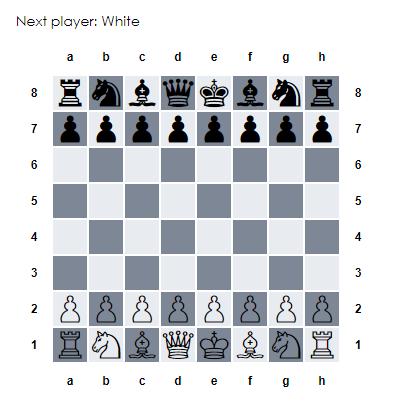

## What this is

A basic, but complete chess board done in React, using CRA.
Only legal moves are allowed.
Threefold repetition is implemented using a modified Zobrist hashing algorithm using 2x32-bit seeds.

Play with it [here](https://nn-tran.github.io/chess/).

